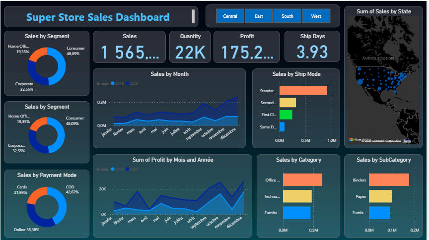
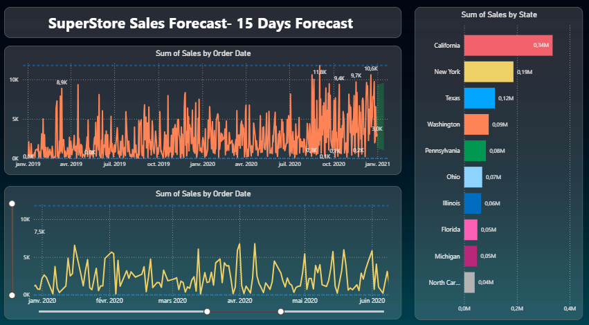

# 🛍️ Super Store Sales Dashboard

This project is a full **data analysis and business intelligence case study** using sales data from a fictional retail store. It demonstrates data cleaning, exploration, and visualization using **Python (pandas)** and **Power BI**.

---

## 📊 Dashboard Overview

The dashboard provides insights into:

- Total sales, profit, and order count
- Sales by category, sub-category, and region
- Average delivery time
- Forecast of future sales (Power BI Forecast feature)
- Customer segments and top-performing products

### 📸 Dashboard Screenshots

#### 📄 Page 1 – Sales Overview


#### 📄 Page 2 – Forecast and Delivery Insights



## 🛠️ Tools & Technologies

- **Power BI**: Interactive dashboard creation, forecasting, and DAX measures
- **DAX**: Custom metrics like Total Sales, Avg Delivery, Forecast
- **Python (pandas)**: Data preprocessing, cleaning, and EDA
- **Power Query**: In-data-model transformation (column typing, filtering)

---

## 📁 Project Structure

```bash
superstore-sales-dashboard/
├── data/                  # Contains the raw sales dataset
├── notebooks/             # Python notebook for cleaning and exploration
├── powerbi/               # Power BI dashboard file (.pbix)
├── images/                # Dashboard screenshots
├── README.md              # Project documentation
├── requirements.txt       # Python libraries used (optional)
